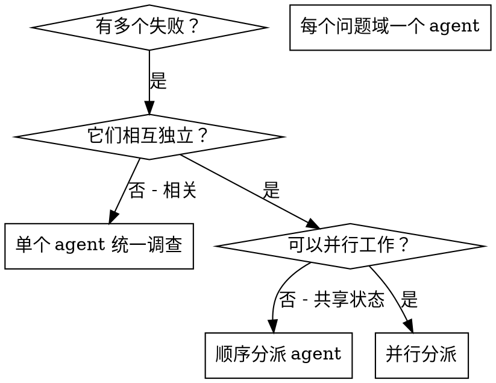

# 并行分派 Agent

## 概览

把任务委派给上下文隔离的专门 agent。通过精确编写指令和上下文，让每个 agent 只关注自己的任务并提高成功率。它们不应继承你当前会话的历史；你只提供完成任务所需的最小上下文。这样也能保留你自己的上下文，用于协调和集成。

当出现多个互不相关的失败时，例如不同测试文件、不同子系统、不同 bug，逐个调查会浪费时间。只要每项调查彼此独立，就可以并行进行。

**核心原则：** 每个独立问题域分派一个 agent，让它们并发工作。

## 什么时候使用



**适合使用：**
- 3 个以上测试文件失败，且根因不同
- 多个子系统独立损坏
- 每个问题不需要其他问题的上下文也能理解
- 调查之间没有共享状态
- 写入范围可以明确拆开，避免多个 agent 改同一批文件

**不要使用：**
- 失败彼此相关，修一个可能修好其他项
- 需要先理解完整系统状态
- agent 会互相干扰，例如编辑同一文件、使用同一外部资源、共享同一数据库状态
- 你还不知道问题域如何拆分

## 工作模式

### 1. 识别独立问题域

按损坏内容分组：
- 文件 A 测试：工具审批流程
- 文件 B 测试：批量完成行为
- 文件 C 测试：中止功能

每个问题域都独立：修工具审批不会影响中止测试。

### 2. 创建聚焦的 agent 任务

每个 agent 都要拿到：
- **具体范围：** 一个测试文件、一个子系统或一组明确文件
- **清晰目标：** 让这些测试通过，或定位这个模块的根因
- **约束：** 不要修改其他代码；不要触碰其他 agent 的写入范围
- **预期输出：** 总结发现、修改内容、验证结果和剩余风险

如果允许 agent 修改代码，必须显式说明它负责的文件或模块。多个 agent 的写入范围应尽量互不重叠。

### 3. 并行分派

```typescript
// 在 Claude Code / AI 环境中
Task("Fix agent-tool-abort.test.ts failures")
Task("Fix batch-completion-behavior.test.ts failures")
Task("Fix tool-approval-race-conditions.test.ts failures")
// 三个任务并发运行
```

### 4. 审查并集成

agent 返回后：
- 阅读每份总结
- 检查修改是否冲突
- 运行完整测试套件
- 集成所有修改
- 对关键路径做抽查，避免多个 agent 犯同类系统性错误

## Agent 提示词结构

好的 agent 提示词应满足：
1. **聚焦**：一个清晰的问题域
2. **自包含**：包含理解问题所需的全部上下文
3. **输出具体**：明确 agent 应返回什么
4. **边界清楚**：说明可改文件、不可改文件和验证方式

```markdown
修复 src/agents/agent-tool-abort.test.ts 中 3 个失败测试：

1. "should abort tool with partial output capture" - 期望消息中包含 'interrupted at'
2. "should handle mixed completed and aborted tools" - fast tool 被中止，但预期应完成
3. "should properly track pendingToolCount" - 期望 3 个结果，实际得到 0

这些看起来是 timing / race condition 问题。你的任务：

1. 阅读测试文件，理解每个测试验证什么
2. 判断根因：是时序问题，还是实际 bug？
3. 修复方式：
   - 用基于事件的等待替代任意 timeout
   - 如果发现中止实现有 bug，就修复实现
   - 如果测试断言的是已变化行为，再调整测试期望

不要只增加 timeout，要找出真实问题。

写入范围：src/agents/agent-tool-abort.test.ts；如必须修改生产代码，先说明原因。

返回：根因总结、修改内容、运行过的验证命令和结果。
```

## 常见错误

**错误：范围太宽**  
“修所有测试”会让 agent 迷路。  
**正确：范围具体**  
“修 `agent-tool-abort.test.ts`”范围明确。

**错误：没有上下文**  
“修 race condition”没有说明位置。  
**正确：提供上下文**  
粘贴错误消息和测试名称。

**错误：没有约束**  
agent 可能顺手重构所有东西。  
**正确：写明约束**  
“不要修改生产代码”或“只修测试”。

**错误：输出要求模糊**  
“修好它”无法让你知道改了什么。  
**正确：输出具体**  
“返回根因和修改总结。”

**错误：写范围重叠**  
多个 agent 同时改同一文件，集成成本会上升。  
**正确：拆开写范围**  
每个 agent 负责不同文件或模块；无法拆开时顺序执行。

## 什么时候不要使用

**相关失败：** 修一个可能修好其他项，先一起调查。  
**需要完整上下文：** 理解问题必须看整个系统。  
**探索式调试：** 你还不知道哪里坏了。  
**共享状态：** agent 会互相干扰，例如编辑同一文件、使用同一个临时目录或同一个测试数据库。  
**高风险操作：** 涉及迁移、删除、强推、外部系统配置时，不要并行交给多个 agent 自动处理。

## 会话中的真实示例

**场景：** 一次重大重构后，3 个文件中出现 6 个测试失败。

**失败：**
- agent-tool-abort.test.ts：3 个失败（时序问题）
- batch-completion-behavior.test.ts：2 个失败（工具未执行）
- tool-approval-race-conditions.test.ts：1 个失败（执行次数 = 0）

**决策：** 问题域独立。中止逻辑、批量完成、race condition 分属不同问题。

**分派：**
```text
Agent 1 → 修 agent-tool-abort.test.ts
Agent 2 → 修 batch-completion-behavior.test.ts
Agent 3 → 修 tool-approval-race-conditions.test.ts
```

**结果：**
- Agent 1：用基于事件的等待替代 timeout
- Agent 2：修复事件结构 bug（threadId 放错位置）
- Agent 3：增加等待，确保异步工具执行完成

**集成：** 所有修复相互独立，无冲突，完整测试套件通过。

**节省时间：** 3 个问题并行解决，耗时接近 1 个问题。

## 关键收益

1. **并行化**：多个调查同时进行
2. **聚焦**：每个 agent 范围更窄，需要追踪的上下文更少
3. **独立性**：agent 之间不互相干扰
4. **速度**：用接近一个任务的时间解决多个问题

## 验证

agent 返回后：
1. **阅读每份总结**：理解改了什么
2. **检查冲突**：是否改了同一批代码
3. **运行完整测试**：确认所有修复合在一起仍然有效
4. **抽查关键路径**：agent 可能犯系统性错误
5. **检查未覆盖风险**：是否有未运行的测试、未验证的平台或未处理的边界情况

## 中国本土化注意事项

- 如果并行任务需要访问 GitHub、GitLab、Gitee、Coding.net、Jira、Linear 或内部平台，先确认每个 agent 是否真的需要外部访问；能用本地 diff / 日志 / 测试完成的，不要求远端权限。
- 国内网络环境下，`gh`、`glab`、npm registry 或内部平台 API 可能不可用；只提示用户按团队规范配置认证令牌、registry 或代理，不自动修改全局配置。
- 如果团队使用飞书、语雀、企业微信或其他外部文档系统，让用户把必要上下文贴到任务说明中；agent 不应假设自己能直接读取这些系统。
- 涉及生产数据、批量删除、关闭 issue、强推、迁移、云资源变更等破坏性操作时，不并行自动执行，必须先列影响范围并取得明确确认。

## 真实世界影响

来自调试会话（2025-10-03）：
- 3 个文件中有 6 个失败
- 并行分派 3 个 agent
- 所有调查并发完成
- 所有修复成功集成
- agent 修改之间零冲突
