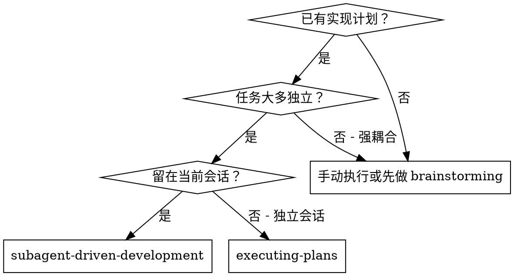

# 子 agent 驱动开发

通过给每个任务派发全新的子 agent 来执行计划，并在每个任务后做两阶段审查：先做规格符合性审查，再做代码质量审查。

**为什么使用子 agent：**你把任务委派给拥有隔离上下文的专门 agent。通过精确构造它们的指令和上下文，可以让它们保持聚焦并完成任务。它们不应该继承你当前会话的上下文或历史；你只给它们完成任务所需的内容。这也能保留你自己的上下文，用于协调工作。

**核心原则：每个任务一个全新子 agent + 两阶段审查（先规格，再质量）= 高质量、快速迭代。**

**连续执行：**不要在任务之间停下来向用户确认。执行计划中的所有任务，不要中途暂停。只有以下情况才停止：出现无法自行解决的 `BLOCKED` 状态、存在真正阻止进展的歧义，或所有任务都已完成。“要继续吗？”这类确认和进度摘要会浪费用户时间；用户已经要求你执行计划，就执行计划。

## 何时使用



**对比 Executing Plans（独立会话）：**

- 同一会话内执行，无需上下文切换。
- 每个任务使用全新子 agent，不污染上下文。
- 每个任务后做两阶段审查：先审规格符合性，再审代码质量。
- 迭代更快，任务之间不需要 human-in-loop。

## 流程

```dot
digraph process {
    rankdir=TB;

    subgraph cluster_per_task {
        label="每个任务";
        "派发实现子 agent（./implementer-prompt.md）" [shape=box];
        "实现子 agent 有问题？" [shape=diamond];
        "回答问题，提供上下文" [shape=box];
        "实现子 agent 实现、测试、提交、自审" [shape=box];
        "派发规格审查子 agent（./spec-reviewer-prompt.md）" [shape=box];
        "规格审查确认代码符合规格？" [shape=diamond];
        "实现子 agent 修复规格缺口" [shape=box];
        "派发代码质量审查子 agent（./code-quality-reviewer-prompt.md）" [shape=box];
        "代码质量审查通过？" [shape=diamond];
        "实现子 agent 修复质量问题" [shape=box];
        "在 TodoWrite 中标记任务完成" [shape=box];
    }

    "读取计划，提取所有任务全文，记录上下文，创建 TodoWrite" [shape=box];
    "还有任务？" [shape=diamond];
    "为完整实现派发最终代码审查子 agent" [shape=box];
    "使用 superpowers:finishing-a-development-branch" [shape=box style=filled fillcolor=lightgreen];
}
```



## 模型选择

使用能胜任该角色的最低能力模型，以节省成本并提高速度。

**机械实现任务**（隔离函数、清晰规格、1-2 个文件）：使用快速、便宜的模型。计划写得足够具体时，大多数实现任务都是机械性的。

**集成和判断任务**（多文件协作、模式匹配、调试）：使用标准模型。

**架构、设计和审查任务：**使用当前可用的最强模型。

**任务复杂度信号：**

- 只涉及 1-2 个文件，且规格完整 -> 便宜模型。
- 涉及多个文件和集成问题 -> 标准模型。
- 需要设计判断或广泛理解代码库 -> 最强模型。

## 处理实现者状态

实现子 agent 会报告四种状态之一。按下面方式处理：

**DONE：**进入规格符合性审查。

**DONE_WITH_CONCERNS：**实现者完成了工作，但标记了疑虑。继续前先阅读这些疑虑。如果疑虑涉及正确性或范围，先处理再审查。如果只是观察项（例如“这个文件变大了”），记录下来并继续审查。

**NEEDS_CONTEXT：**实现者需要未提供的信息。补充缺失上下文后重新派发。

**BLOCKED：**实现者无法完成任务。评估阻塞项：

1. 如果是上下文问题，补充更多上下文，并用同一模型重新派发。
2. 如果任务需要更多推理，换用更强模型重新派发。
3. 如果任务太大，拆成更小任务。
4. 如果计划本身有问题，升级给用户处理。

**绝不要**忽略升级，也不要在没有任何变化的情况下强迫同一模型重试。实现者说卡住了，就说明必须改变某些条件。

## Prompt 模板

- `./implementer-prompt.md` - 派发实现子 agent。
- `./spec-reviewer-prompt.md` - 派发规格符合性审查子 agent。
- `./code-quality-reviewer-prompt.md` - 派发代码质量审查子 agent。

## 示例流程

```text
你：我正在使用子 agent 驱动开发来执行这个计划。

[读取一次计划文件：docs/superpowers/plans/feature-plan.md]
[提取全部 5 个任务的完整文本和上下文]
[用全部任务创建 TodoWrite 任务列表]

任务 1：Hook 安装脚本

[获取任务 1 文本和上下文（已提取）]
[用完整任务文本 + 上下文派发实现子 agent]

实现者：“开始前我想确认：hook 应安装在用户级别还是系统级别？”

你：“用户级别（~/.config/superpowers/hooks/）”

实现者：“明白。现在开始实现...”
[稍后] 实现者：
  - 已实现 install-hook 命令
  - 已添加测试，5/5 通过
  - 自审：发现遗漏 --force flag，已补上
  - 已提交

[派发规格符合性审查者]
规格审查者：✅ 符合规格 - 所有需求都满足，没有额外内容

[获取 git SHA，派发代码质量审查者]
代码审查者：优点：测试覆盖好，代码清晰。问题：无。批准。

[标记任务 1 完成]

任务 2：恢复模式

[获取任务 2 文本和上下文（已提取）]
[用完整任务文本 + 上下文派发实现子 agent]

实现者：[无问题，继续]
实现者：
  - 已添加 verify/repair 模式
  - 8/8 测试通过
  - 自审：无问题
  - 已提交

[派发规格符合性审查者]
规格审查者：❌ 发现问题：
  - 缺失：进度报告（规格要求“每 100 项报告一次”）
  - 额外：添加了未要求的 --json flag

[实现者修复问题]
实现者：已移除 --json flag，并添加进度报告

[规格审查者再次审查]
规格审查者：✅ 现在符合规格

[派发代码质量审查者]
代码审查者：优点：扎实。问题（Important）：魔法数字 100

[实现者修复]
实现者：已提取 PROGRESS_INTERVAL 常量

[代码审查者再次审查]
代码审查者：✅ 批准

[标记任务 2 完成]

...

[全部任务完成后]
[派发最终代码审查者]
最终审查者：所有需求已满足，可以合并

完成！
```

## 优势

**对比手动执行：**

- 子 agent 会自然遵循 TDD。
- 每个任务都有新鲜上下文，不混乱。
- 并行安全：子 agent 之间不会互相干扰。
- 子 agent 可以在开始前和工作中提问。

**对比 Executing Plans：**

- 同一会话内执行，无需交接。
- 连续推进，无需等待。
- 自动设置审查检查点。

**效率收益：**

- 没有重复读文件开销：控制者提供完整文本。
- 控制者精确整理所需上下文。
- 子 agent 一开始就拿到完整信息。
- 问题会在开始工作前暴露，而不是事后才出现。

**质量门：**

- 自审在交接前捕捉问题。
- 两阶段审查：规格符合性，然后代码质量。
- 审查循环确保修复真的生效。
- 规格符合性防止多做或少做。
- 代码质量确保实现构造良好。

**成本：**

- 更多子 agent 调用（每个任务 1 个实现者 + 2 个审查者）。
- 控制者需要更多前期准备（预先提取所有任务）。
- 审查循环会增加迭代次数。
- 但它能更早捕捉问题，比后期调试更便宜。

## 红色警报

**绝不要：**

- 未经用户明确同意就在 `main` / `master` 分支上开始实现。
- 跳过审查（规格符合性或代码质量）。
- 带着未修复问题继续推进。
- 并行派发多个实现子 agent（会冲突）。
- 让子 agent 自己读取计划文件（应提供完整文本）。
- 跳过场景上下文（子 agent 需要理解任务位置）。
- 忽略子 agent 的问题（先回答，再让它继续）。
- 在规格符合性上接受“差不多”（规格审查者发现问题 = 未完成）。
- 跳过复审循环（审查者发现问题 = 实现者修复 = 再审）。
- 用实现者自审替代真正审查（两者都需要）。
- **在规格符合性通过前开始代码质量审查**（顺序错误）。
- 任一审查仍有开放问题时进入下一个任务。

**如果子 agent 提问：**

- 清楚、完整地回答。
- 必要时提供额外上下文。
- 不要催促它直接开始实现。

**如果审查者发现问题：**

- 由实现者（同一个子 agent）修复。
- 审查者再次审查。
- 重复直到批准。
- 不要跳过复审。

**如果子 agent 任务失败：**

- 派发修复子 agent，并给出具体指令。
- 不要手动修复（会污染上下文）。

## 集成关系

**必需工作流 skill：**

- **`superpowers:using-git-worktrees`** - 确保隔离工作区存在（创建新的，或验证已有的）。
- **`superpowers:writing-plans`** - 创建本 skill 要执行的计划。
- **`superpowers:requesting-code-review`** - 给审查子 agent 使用的代码审查模板。
- **`superpowers:finishing-a-development-branch`** - 所有任务完成后收尾开发工作。

**子 agent 应使用：**

- **`superpowers:test-driven-development`** - 子 agent 对每个任务遵循 TDD。

**替代流程：**

- **`superpowers:executing-plans`** - 不在同一会话执行时使用。

## 中国本土化注意事项

- 如果子 agent 需要运行依赖安装、测试、构建、GitHub/GitLab/Gitee/Coding.net/Jira/Linear 或本地 markdown 流程相关命令，遇到 registry、代理或认证失败时，只报告失败原因并请求用户指示，不自动改全局配置或替用户登录。
- 如果任务涉及语雀、飞书等外部文档系统，子 agent 不能直接操作时，应输出 markdown 草稿或文本步骤，交给用户处理。
- 分派前确认任务确实独立；如果任务之间存在文件或状态共享，不要并行派发多个实现子 agent。
