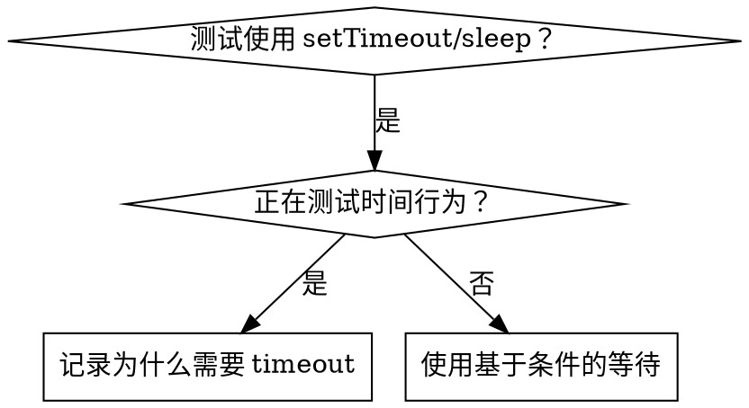

# 基于条件的等待

## 总览

不稳定测试经常用任意延迟猜时间。这会制造竞态：快机器通过，负载下或 CI 中失败。

**核心原则：等待你真正关心的条件，而不是猜它需要多久。**

## 何时使用



**使用场景：**

- 测试有任意延迟（`setTimeout`、`sleep`、`time.sleep()`）
- 测试不稳定（有时通过，负载下失败）
- 并行运行时测试超时
- 等待异步操作完成

**不适用：**

- 正在测试真实时间行为（debounce、throttle 间隔）
- 如果使用任意 timeout，必须记录为什么

## 核心模式

```typescript
// ❌ BEFORE: Guessing at timing
await new Promise(r => setTimeout(r, 50));
const result = getResult();
expect(result).toBeDefined();

// ✅ AFTER: Waiting for condition
await waitFor(() => getResult() !== undefined);
const result = getResult();
expect(result).toBeDefined();
```

## 快速模式

| 场景 | 模式 |
|---|---|
| 等待事件 | `waitFor(() => events.find(e => e.type === 'DONE'))` |
| 等待状态 | `waitFor(() => machine.state === 'ready')` |
| 等待数量 | `waitFor(() => items.length >= 5)` |
| 等待文件 | `waitFor(() => fs.existsSync(path))` |
| 复杂条件 | `waitFor(() => obj.ready && obj.value > 10)` |

## 实现

通用轮询函数：

```typescript
async function waitFor<T>(
  condition: () => T | undefined | null | false,
  description: string,
  timeoutMs = 5000
): Promise<T> {
  const startTime = Date.now();

  while (true) {
    const result = condition();
    if (result) return result;

    if (Date.now() - startTime > timeoutMs) {
      throw new Error(`Timeout waiting for ${description} after ${timeoutMs}ms`);
    }

    await new Promise(r => setTimeout(r, 10)); // Poll every 10ms
  }
}
```

完整实现见本目录中的 `condition-based-waiting-example.ts`，其中包含真实调试会话里的领域辅助函数：`waitForEvent`、`waitForEventCount`、`waitForEventMatch`。

## 常见错误

**❌ 轮询太快：**`setTimeout(check, 1)` - 浪费 CPU  
**✅ 修复：**每 10ms 轮询一次

**❌ 没有 timeout：**条件永远不满足时会无限循环  
**✅ 修复：**始终包含 timeout，并给出清晰错误

**❌ 陈旧数据：**循环前缓存状态  
**✅ 修复：**在循环内调用 getter，获取新数据

## 什么时候任意 timeout 是正确的

```typescript
// Tool ticks every 100ms - need 2 ticks to verify partial output
await waitForEvent(manager, 'TOOL_STARTED'); // First: wait for condition
await new Promise(r => setTimeout(r, 200));   // Then: wait for timed behavior
// 200ms = 2 ticks at 100ms intervals - documented and justified
```

**要求：**

1. 先等待触发条件
2. 基于已知时间，而不是猜测
3. 注释说明为什么

## 真实影响

来自调试会话（2025-10-03）：

- 修复 3 个文件中的 15 个不稳定测试
- 通过率：60% -> 100%
- 执行时间：快 40%
- 不再有竞态
