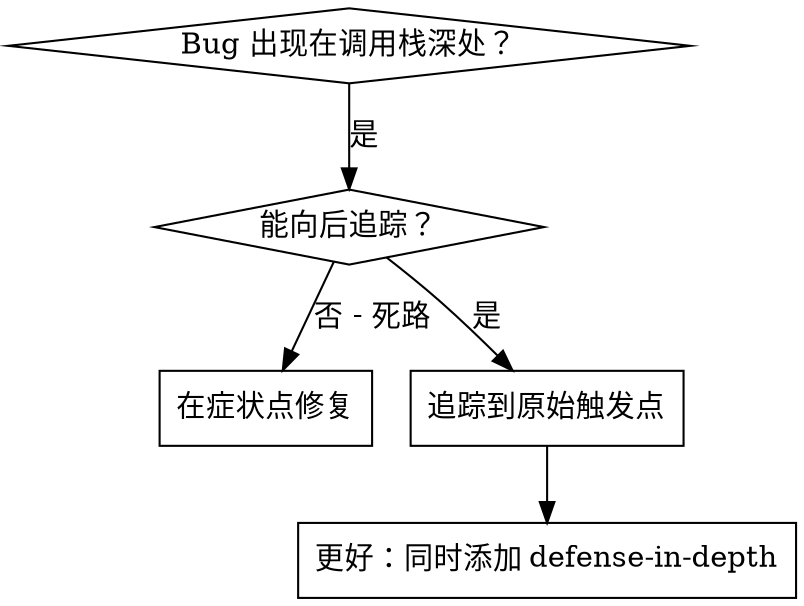
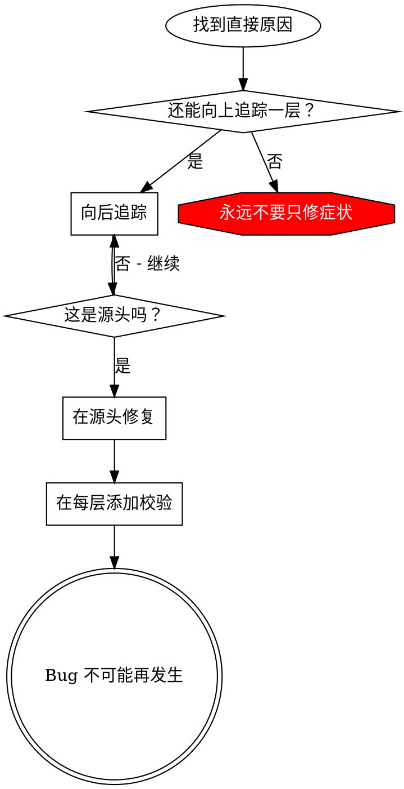

# 根因追踪

## 总览

bug 经常出现在调用栈深处（在错误目录执行 `git init`、文件创建到错误位置、数据库用错路径打开）。直觉会让你在错误出现的地方修，但那只是处理症状。

**核心原则：沿调用链向后追踪，直到找到原始触发点，然后在源头修复。**

## 何时使用



**使用场景：**

- 错误发生在执行深处，而不是入口点
- 堆栈显示很长的调用链
- 不清楚无效数据从哪里来
- 需要找出哪个测试/代码触发问题

## 追踪流程

### 1. 观察症状

```text
Error: git init failed in ~/project/packages/core
```

### 2. 找直接原因

**哪段代码直接导致它？**

```typescript
await execFileAsync('git', ['init'], { cwd: projectDir });
```

### 3. 追问：谁调用了这里？

```typescript
WorktreeManager.createSessionWorktree(projectDir, sessionId)
  → called by Session.initializeWorkspace()
  → called by Session.create()
  → called by test at Project.create()
```

### 4. 继续向上追踪

**传入了什么值？**

- `projectDir = ''`（空字符串！）
- 空字符串作为 `cwd` 会解析为 `process.cwd()`
- 那就是源代码目录！

### 5. 找原始触发点

**空字符串从哪里来？**

```typescript
const context = setupCoreTest(); // Returns { tempDir: '' }
Project.create('name', context.tempDir); // Accessed before beforeEach!
```

## 添加堆栈追踪

无法手动追踪时，添加诊断信息：

```typescript
// Before the problematic operation
async function gitInit(directory: string) {
  const stack = new Error().stack;
  console.error('DEBUG git init:', {
    directory,
    cwd: process.cwd(),
    nodeEnv: process.env.NODE_ENV,
    stack,
  });

  await execFileAsync('git', ['init'], { cwd: directory });
}
```

**关键：**测试中使用 `console.error()`（不要用 logger，可能不显示）。

**运行并捕获：**

```bash
npm test 2>&1 | grep 'DEBUG git init'
```

**分析堆栈：**

- 找测试文件名
- 找触发调用的行号
- 识别模式（同一个测试？同一个参数？）

## 找出污染测试

如果某个文件/状态在测试期间出现，但不知道哪个测试造成：

使用本目录中的二分脚本 `find-polluter.sh`：

```bash
./find-polluter.sh '.git' 'src/**/*.test.ts'
```

它会逐个运行测试，遇到第一个污染源就停止。用法见脚本。

## 真实示例：空 projectDir

**症状：**`.git` 被创建到 `packages/core/`（源代码目录）

**追踪链：**

1. `git init` 在 `process.cwd()` 中运行 <- `cwd` 参数为空
2. WorktreeManager 收到空 `projectDir`
3. Session.create() 被传入空字符串
4. 测试在 beforeEach 前访问了 `context.tempDir`
5. setupCoreTest() 初始返回 `{ tempDir: '' }`

**根因：**顶层变量初始化访问了空值。

**修复：**把 tempDir 改成 getter；如果在 beforeEach 前访问就抛错。

**同时添加 defense-in-depth：**

- 第 1 层：Project.create() 校验目录
- 第 2 层：WorkspaceManager 校验非空
- 第 3 层：NODE_ENV guard 拒绝在 tmpdir 外执行 git init
- 第 4 层：git init 前记录堆栈

## 关键原则



**永远不要只在错误出现的位置修。**向后追踪，找到原始触发点。

## 堆栈追踪技巧

**测试中：**用 `console.error()`，不要用 logger；logger 可能被抑制。  
**操作前：**在危险操作前记录日志，不要等失败后。  
**包含上下文：**目录、cwd、环境变量、时间戳。  
**捕获堆栈：**`new Error().stack` 会显示完整调用链。

## 真实影响

来自调试会话（2025-10-03）：

- 通过 5 层追踪找到根因
- 在源头修复（getter validation）
- 添加 4 层防御
- 1847 个测试通过，零污染
