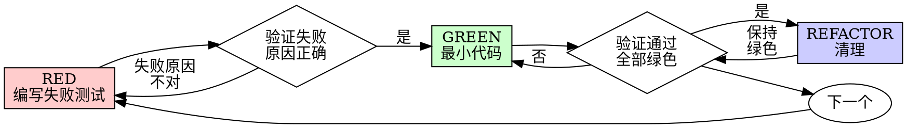

# 测试驱动开发（TDD）

## 总览

先写测试。看着它失败。再写刚好让它通过的最小代码。

**核心原则：如果你没有亲眼看到测试失败，就不知道它是否真的测到了正确的东西。**

**违反规则字面要求，就是违反规则精神。**

## 何时使用

**始终使用：**

- 新功能
- bug 修复
- 重构
- 行为变更

**例外（先询问你的 human partner）：**

- 一次性原型
- 生成代码
- 配置文件

正在想“这次先跳过 TDD 吧”？停下。这是在合理化。

## 铁律

```text
没有先失败的测试，就不要写生产代码
```

先写了代码再补测试？删除它。重新开始。

**没有例外：**

- 不要把它留作“参考”
- 不要一边写测试一边“改造”它
- 不要看它
- 删除就是删除

从测试重新实现。就这样。

## 红-绿-重构



### RED - 编写失败测试

写一个最小测试，展示应该发生什么。

<Good>
```typescript
test('retries failed operations 3 times', async () => {
  let attempts = 0;
  const operation = () => {
    attempts++;
    if (attempts < 3) throw new Error('fail');
    return 'success';
  };

  const result = await retryOperation(operation);

  expect(result).toBe('success');
  expect(attempts).toBe(3);
});
```
名称清晰，测试真实行为，只测一件事
</Good>

<Bad>
```typescript
test('retry works', async () => {
  const mock = jest.fn()
    .mockRejectedValueOnce(new Error())
    .mockRejectedValueOnce(new Error())
    .mockResolvedValueOnce('success');
  await retryOperation(mock);
  expect(mock).toHaveBeenCalledTimes(3);
});
```
名称含糊，测试的是 mock 而不是代码
</Bad>

**要求：**

- 一个行为
- 名称清晰
- 真实代码（除非无法避免，否则不要用 mock）

### 验证 RED - 看着它失败

**必需。永远不要跳过。**

```bash
npm test path/to/test.test.ts
```

确认：

- 测试失败（不是报错）
- 失败信息符合预期
- 失败原因是功能缺失（不是拼写错误）

**测试通过了？** 你测的是已有行为。修正测试。

**测试报错了？** 修正错误，重新运行，直到它因为正确原因失败。

### GREEN - 最小代码

写最简单的代码，让测试通过。

<Good>
```typescript
async function retryOperation<T>(fn: () => Promise<T>): Promise<T> {
  for (let i = 0; i < 3; i++) {
    try {
      return await fn();
    } catch (e) {
      if (i === 2) throw e;
    }
  }
  throw new Error('unreachable');
}
```
刚好足以通过测试
</Good>

<Bad>
```typescript
async function retryOperation<T>(
  fn: () => Promise<T>,
  options?: {
    maxRetries?: number;
    backoff?: 'linear' | 'exponential';
    onRetry?: (attempt: number) => void;
  }
): Promise<T> {
  // YAGNI
}
```
过度设计
</Bad>

不要添加功能，不要重构其他代码，也不要做超出测试要求的“改进”。

### 验证 GREEN - 看着它通过

**必需。**

```bash
npm test path/to/test.test.ts
```

确认：

- 测试通过
- 其他测试仍然通过
- 输出干净（没有错误、没有警告）

**测试失败了？** 修代码，不要改测试。

**其他测试失败了？** 立刻修复。

### REFACTOR - 清理

只有绿色之后才能做：

- 去除重复
- 改善命名
- 提取辅助函数

保持测试绿色。不要添加行为。

### 重复

为下一个功能点写下一个失败测试。

## 好测试

| 质量 | 好 | 差 |
|---|---|---|
| **最小** | 只测一件事。名称里有 “and”？拆开。 | `test('validates email and domain and whitespace')` |
| **清晰** | 名称描述行为 | `test('test1')` |
| **表达意图** | 展示期望的 API | 掩盖代码应该如何使用 |

## 为什么顺序很重要

**“我之后写测试来验证能不能用。”**

代码之后写的测试会立刻通过。立刻通过什么也证明不了：

- 可能测错东西
- 可能测的是实现，而不是行为
- 可能漏掉你忘记的边界情况
- 你从未亲眼看到它发现 bug

先写测试迫使你看到测试失败，证明它确实测到了东西。

**“我已经手动测试了所有边界情况。”**

手动测试是临时性的。你以为自己测全了，但实际情况是：

- 没有测试记录
- 代码改变后无法重复运行
- 压力下很容易漏掉情况
- “我试过能用”不等于全面覆盖

自动化测试是系统性的。它每次都按同样方式运行。

**“删除 X 小时的工作太浪费了。”**

这是沉没成本谬误。时间已经花掉了。现在的选择是：

- 删除并用 TDD 重写（再花 X 小时，高信心）
- 保留它并事后补测试（30 分钟，低信心，很可能有 bug）

真正的“浪费”，是保留你无法信任的代码。没有真实测试的工作代码就是技术债。

**“TDD 太教条了，务实就应该灵活。”**

TDD 正是务实：

- 在提交前发现 bug（比事后调试更快）
- 防止回归（测试会立刻抓住破坏）
- 记录行为（测试展示代码怎么用）
- 支持重构（放心修改，测试会兜底）

“务实”的捷径 = 线上调试 = 更慢。

**“事后补测试也能达到同样目标，重要的是精神，不是仪式。”**

不。事后测试回答“这段代码做了什么？”先写测试回答“这段代码应该做什么？”

事后测试会被你的实现带偏。你测的是你已经写出来的东西，不是需求真正要求的东西。你验证的是自己记得的边界情况，不是提前发现的边界情况。

先写测试迫使你在实现前发现边界情况。事后测试只验证你是否记住了所有情况（你不会全记得）。

30 分钟事后补测试不等于 TDD。你得到了覆盖率，失去了“测试确实有效”的证据。

## 常见合理化

| 借口 | 现实 |
|---|---|
| “太简单了，不用测。” | 简单代码也会坏。测试只要 30 秒。 |
| “我之后补测试。” | 立刻通过的测试证明不了什么。 |
| “事后测试也能达到同样目标。” | 事后测试 = “这做了什么？”先写测试 = “这应该做什么？” |
| “我已经手动测过了。” | 临时测试不等于系统测试。没有记录，不能重跑。 |
| “删除 X 小时太浪费。” | 沉没成本谬误。保留未验证代码才是技术债。 |
| “保留作参考，先写测试。” | 你会改造它。那就是事后测试。删除就是删除。 |
| “需要先探索一下。” | 可以。探索代码丢掉，然后从 TDD 开始。 |
| “测试很难写 = 设计不清楚。” | 听测试的。难测试 = 难使用。 |
| “TDD 会拖慢我。” | TDD 比调试更快。务实 = 先测试。 |
| “手动测试更快。” | 手动测试证明不了边界情况。每次修改你都得重测。 |
| “现有代码没有测试。” | 你正在改进它。为现有代码补测试。 |

## 红色警报 - 停下并重来

- 先写代码，再写测试
- 实现后才补测试
- 测试第一次就通过
- 说不清测试为什么失败
- “之后”才加测试
- 正在合理化“就这一次”
- “我已经手动测过了”
- “事后测试也能达到同样目的”
- “重要的是精神，不是仪式”
- “保留作参考”或“改造已有代码”
- “已经花了 X 小时，删除太浪费”
- “TDD 太教条，我是在务实”
- “这次情况特殊，因为……”

**这些都意味着：删除代码。从 TDD 重新开始。**

## 示例：bug 修复

**Bug：**空邮箱被接受

**RED**
```typescript
test('rejects empty email', async () => {
  const result = await submitForm({ email: '' });
  expect(result.error).toBe('Email required');
});
```

**验证 RED**
```bash
$ npm test
FAIL: expected 'Email required', got undefined
```

**GREEN**
```typescript
function submitForm(data: FormData) {
  if (!data.email?.trim()) {
    return { error: 'Email required' };
  }
  // ...
}
```

**验证 GREEN**
```bash
$ npm test
PASS
```

**REFACTOR**

如有需要，再提取多个字段共用的校验逻辑。

## 验证清单

标记工作完成前：

- [ ] 每个新增函数/方法都有测试
- [ ] 实现前已经看见每个测试失败
- [ ] 每个测试都因预期原因失败（功能缺失，而不是拼写错误）
- [ ] 写了让测试通过的最小代码
- [ ] 所有测试通过
- [ ] 输出干净（没有错误、没有警告）
- [ ] 测试使用真实代码（只有无法避免时才用 mock）
- [ ] 已覆盖边界情况和错误情况

有任何一项不能勾选？你跳过了 TDD。重新开始。

## 卡住时

| 问题 | 解决方式 |
|---|---|
| 不知道怎么测试 | 写你希望拥有的 API。先写断言。询问你的 human partner。 |
| 测试太复杂 | 设计太复杂。简化接口。 |
| 必须 mock 一切 | 代码耦合太重。使用依赖注入。 |
| 测试准备太庞大 | 提取辅助函数。仍然复杂？简化设计。 |

## 调试集成

发现 bug？先写一个失败测试复现它。然后走 TDD 循环。测试证明修复有效，也防止回归。

永远不要在没有测试的情况下修 bug。

## 测试反模式

添加 mock 或测试工具时，阅读 @testing-anti-patterns.md，避免常见陷阱：

- 测试 mock 行为，而不是真实行为
- 给生产类添加只供测试使用的方法
- 在不理解依赖的情况下 mock

## 中国本土化注意事项

- 如果测试命令因为 npm/pnpm registry、代理、认证、CI 镜像或依赖下载失败而无法运行，只报告失败原因并询问用户下一步；不要自动修改全局 registry、代理、认证令牌或 shell 配置。
- 如果项目没有现成测试框架，先与用户确认最小可接受的验证路径或测试框架选择；不要为了满足 TDD 擅自引入第三方依赖。
- 断言用户可见文案、错误消息、文档输出或 issue/PR 正文时，遵循项目语言和团队约定；中文项目默认使用中文文案，不要为了示例方便强行改成英文。
- 如果测试需要 GitHub、GitLab、Gitee、Coding.net、Jira、Linear 或其他外部系统，优先隔离本地行为；确需远端认证或网络访问时，先说明依赖并等待用户确认。

## 最终规则

```text
生产代码 -> 测试存在，并且先失败过
否则 -> 不是 TDD
```

没有你的 human partner 许可，就没有例外。
