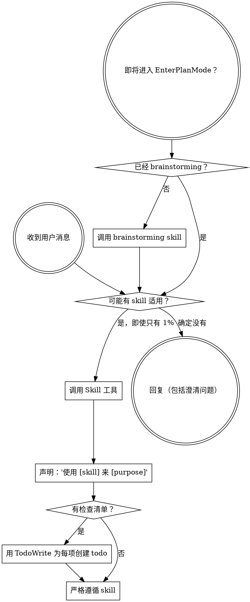

<SUBAGENT-STOP>
如果你是被派发来执行特定任务的子 agent，跳过本 skill。
</SUBAGENT-STOP>

<EXTREMELY-IMPORTANT>
只要你认为当前工作有哪怕 1% 的可能适用某个 skill，就绝对必须调用该 skill。

如果某个 skill 适用于你的任务，你没有选择权。你必须使用它。

这不是可协商项，不是可选项。不要为跳过它找理由。
</EXTREMELY-IMPORTANT>

## 指令优先级

Superpowers skills 可以覆盖默认系统提示行为，但**用户指令始终优先**：

1. **用户的显式指令**（`CLAUDE.md`、`GEMINI.md`、`AGENTS.md`、直接请求）：最高优先级。
2. **Superpowers skills**：与默认系统行为冲突时，覆盖默认行为。
3. **默认系统提示**：最低优先级。

如果 `CLAUDE.md`、`GEMINI.md` 或 `AGENTS.md` 说“不要使用 TDD”，而某个 skill 说“始终使用 TDD”，遵循用户指令。用户拥有最终控制权。

## 如何访问 Skills

**在 Claude Code 中：** 使用 `Skill` 工具。调用 skill 后，它的内容会被加载并展示给你；直接遵循它。不要用 `Read` 工具读取 skill 文件。

**在 Copilot CLI 中：** 使用 `skill` 工具。Skills 会从已安装插件中自动发现。`skill` 工具的作用和 Claude Code 的 `Skill` 工具相同。

**在 Gemini CLI 中：** Skills 通过 `activate_skill` 工具激活。Gemini 会在会话开始时加载 skill 元数据，并按需激活完整内容。

**在其他环境中：** 查看所在平台文档，确认 skills 如何加载。

## 平台适配

Skills 使用 Claude Code 的工具名。非 Claude Code 平台请查看工具等价表：Copilot CLI 见 `references/copilot-tools.md`，Codex 见 `references/codex-tools.md`。Gemini CLI 用户会通过 `GEMINI.md` 自动加载工具映射。

# 使用 Skills

## 规则

**在任何回复或动作之前，先调用相关或用户明确要求的 skills。** 只要有 1% 的可能适用，就调用 skill 检查。如果调用后发现该 skill 不适合当前场景，可以不用继续执行它。

## 危险信号

出现以下想法时，立即停下：你正在给跳过 skill 找理由。

| 想法 | 现实 |
|------|------|
| “这只是个简单问题” | 问题也是任务。检查 skills。 |
| “我需要先问更多上下文” | skill 检查在澄清问题之前。 |
| “我先探索一下代码库” | skills 会告诉你如何探索。先检查。 |
| “我可以快速看一下 git / 文件” | 文件没有对话上下文。先检查 skills。 |
| “我先收集信息” | skills 会告诉你如何收集信息。 |
| “这不需要正式 skill” | 只要存在适用 skill，就使用它。 |
| “我记得这个 skill” | skills 会演进。读取当前版本。 |
| “这不算任务” | 有动作就是任务。检查 skills。 |
| “这个 skill 太重了” | 简单事也会变复杂。使用它。 |
| “我就先做这一件事” | 做任何事之前先检查。 |
| “这样感觉效率更高” | 无纪律行动会浪费时间。skills 用来防止这一点。 |
| “我知道它什么意思” | 知道概念不等于使用 skill。调用它。 |

## Skill 优先级

多个 skill 可能适用时，按以下顺序使用：

1. **基础环境 skills 优先**（zh-cn-mode）：在产出任何文档或注释之前确保语言规则已加载。
2. **流程类 skills 其次**（brainstorming、debugging）：它们决定如何处理任务。
3. **实现类 skills**（frontend-design、mcp-builder）：它们指导具体执行。

“构建 X” -> 先用 `brainstorming`，再用实现类 skills。

“修这个 bug” -> 先用 debugging，再用领域相关 skills。

## Skill 类型

**刚性 skill**（TDD、debugging）：严格遵循。不要把纪律“灵活化”掉。

**灵活 skill**（模式类）：根据上下文应用原则。

skill 本身会说明它属于哪一类。

## 用户指令

用户指令说明做什么，不说明如何绕过流程。“添加 X”或“修复 Y”不代表可以跳过工作流。
