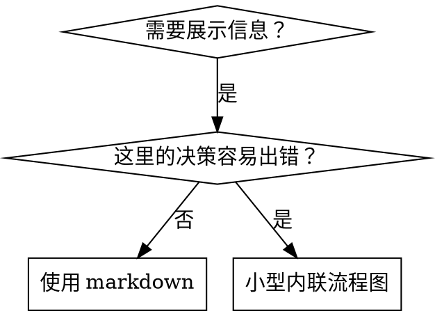

# 编写 Skills

## 概览

**编写 skills 就是把测试驱动开发（TDD）用于流程文档。**

**个人 skills 位于 agent 对应目录中，例如 Claude Code 的 `~/.claude/skills`，Codex 的 `~/.agents/skills/`。**

你先写测试用例（用子 agent 跑压力场景），看它失败（基线行为），再写 skill（文档），看测试通过（agent 遵守），最后重构（堵住漏洞）。

**核心原则：** 如果你没有看过 agent 在没有 skill 时如何失败，就不知道这个 skill 是否教对了内容。

**必备背景：** 你必须理解 `superpowers:test-driven-development`。它定义 RED-GREEN-REFACTOR 基本循环。本 skill 把这个循环用于文档。

**官方指导：** Anthropic 官方 skill 编写最佳实践见 `anthropic-best-practices.md`。本文补充 TDD 导向的模式和准则。

## 什么是 Skill？

**skill** 是经过验证的技术、模式或工具参考指南。Skills 帮助未来的 Claude 实例找到并应用有效做法。

**Skills 是：** 可复用技术、模式、工具、参考指南。

**Skills 不是：** 你某次解决问题的叙事复盘。

## Skills 的 TDD 映射

| TDD 概念 | Skill 创建 |
|----------|------------|
| **测试用例** | 子 agent 压力场景 |
| **生产代码** | Skill 文档（`SKILL.md`） |
| **测试失败（RED）** | 没有 skill 时，agent 违反规则（基线） |
| **测试通过（GREEN）** | 有 skill 时，agent 遵守规则 |
| **重构** | 堵住漏洞，同时保持遵守 |
| **先写测试** | 写 skill 前先跑基线场景 |
| **看它失败** | 记录 agent 使用的具体借口 |
| **最小代码** | 写 skill，只处理这些具体违规 |
| **看它通过** | 验证 agent 现在遵守 |
| **重构循环** | 找新借口 -> 堵住 -> 重新验证 |

整个 skill 创建流程都遵循 RED-GREEN-REFACTOR。

## 何时创建 Skill

**适合创建：**

- 这个技术对你来说不是直觉显然的。
- 你会在多个项目中再次引用它。
- 模式具有广泛适用性，不是单项目规则。
- 其他人也会受益。

**不要为这些创建：**

- 一次性解决方案。
- 已在其他地方充分记录的标准实践。
- 项目特定约定（放进 `CLAUDE.md`）。
- 机械约束（如果能用正则或验证自动执行，就自动化；文档留给判断类问题）。

## Skill 类型

### Technique

有具体步骤可遵循的方法，例如 condition-based-waiting、root-cause-tracing。

### Pattern

关于问题的思考方式，例如 flatten-with-flags、test-invariants。

### Reference

API 文档、语法指南、工具文档，例如 office docs。

## 目录结构

```
skills/
  skill-name/
    SKILL.md              # 主参考（必需）
    supporting-file.*     # 仅在需要时添加
```

**扁平命名空间**：所有 skills 处于一个可搜索命名空间中。

**单独拆文件用于：**

1. **重型参考**（100+ 行）：API 文档、完整语法。
2. **可复用工具**：脚本、工具、模板。

**内联保留：**

- 原则和概念。
- 代码模式（少于 50 行）。
- 其他所有轻量内容。

## `SKILL.md` 结构

**Frontmatter（YAML）：**

- 必需字段：`name` 和 `description`。完整字段见 [agentskills.io/specification](https://agentskills.io/specification)。
- 总长度最多 1024 字符。
- `name`：仅使用字母、数字和连字符；不要用括号或特殊字符。
- `description`：第三人称，只描述何时使用；不要描述流程。
  - 英文原版建议用 `Use when...` 开头；中文本地化时用“用户说...”或自然触发场景。
  - 包含具体症状、场景和上下文。
  - **不要总结 skill 流程或工作流**（原因见 CSO 小节）。
  - 尽量控制在 500 字符内。

```markdown
# Skill Name

## Overview
用 1-2 句话说明它是什么、核心原则是什么。

## When to Use
[如果决策不直观，放一个小型内联流程图]

用列表说明症状和使用场景。
说明何时不要使用。

## Core Pattern
用于 technique / pattern：前后对比代码。

## Quick Reference
用表格或列表承载常见操作，方便扫描。

## Implementation
简单模式内联代码。
重型参考或可复用工具链接到单独文件。

## Common Mistakes
常见错误 + 修复方式。

## Real-World Impact
可选，写具体结果。
```

## Claude Search Optimization（CSO）

**发现能力很关键：** 未来 Claude 需要找到你的 skill。

### 1. 丰富 description 字段

**目的：** Claude 读取 `description` 来决定当前任务是否要加载某个 skill。它应回答：“我现在该读这个 skill 吗？”

**关键：Description = 何时使用，不是 skill 做什么。**

`description` 只描述触发条件。不要总结 skill 的流程或工作流。

**为什么重要：** 测试发现，当 description 总结流程时，Claude 可能只照 description 做，而不读完整 skill。某个 description 写了“任务之间做 code review”，Claude 就只做一次 review，即使 skill 流程图明确要求两阶段 review。

把 description 改成只写触发条件后，Claude 才会读流程图并遵循两阶段审查。

**陷阱：** 总结工作流的 description 会成为 Claude 走捷径的入口。skill 正文会变成它跳过的文档。

```yaml
# ❌ 错误：总结工作流，Claude 可能只照这里做
description: Use when executing plans - dispatches subagent per task with code review between tasks

# ❌ 错误：流程细节太多
description: Use for TDD - write test first, watch it fail, write minimal code, refactor

# ✅ 正确：只写触发条件，不总结流程
description: Use when executing implementation plans with independent tasks in the current session

# ✅ 正确：只写触发条件
description: Use when implementing any feature or bugfix, before writing implementation code
```

**内容要点：**

- 使用具体触发词、症状和场景。
- 描述问题本身，例如 race conditions、inconsistent behavior；不要只写语言特定症状，例如 `setTimeout`、`sleep`。
- 除非 skill 是技术专用，否则触发条件应尽量技术无关。
- 如果是技术专用 skill，在触发条件里明确技术范围。
- 用第三人称写；它会注入系统提示。
- **不要总结 skill 流程或工作流。**

### 2. 关键词覆盖

使用 Claude 可能搜索的词：

- 错误信息：`Hook timed out`、`ENOTEMPTY`、`race condition`。
- 症状：`flaky`、`hanging`、`zombie`、`pollution`。
- 同义词：`timeout/hang/freeze`、`cleanup/teardown/afterEach`。
- 工具：实际命令、库名、文件类型。

### 3. 描述性命名

**用主动语态，动词优先：**

- ✅ `creating-skills`，不要 `skill-creation`。
- ✅ `condition-based-waiting`，不要 `async-test-helpers`。

### 4. Token 效率

**问题：** getting-started 和经常被引用的 skills 会进入很多对话。每个 token 都有成本。

**目标字数：**

- getting-started 工作流：每个少于 150 词。
- 高频加载 skill：总计少于 200 词。
- 其他 skill：少于 500 词，仍需简洁。

**技巧：**

- 把细节移到工具 `--help`。
- 用交叉引用，不重复已有 skill 的流程。
- 压缩示例。
- 删除重复内容。

**验证：**

```bash
wc -w skills/path/SKILL.md
# getting-started workflows: aim for <150 each
# Other frequently-loaded: aim for <200 total
```

### 5. 引用其他 Skills

写文档引用其他 skills 时，只使用 skill 名，并明确要求级别：

- ✅ `**REQUIRED SUB-SKILL:** Use superpowers:test-driven-development`
- ✅ `**REQUIRED BACKGROUND:** You MUST understand superpowers:systematic-debugging`
- ❌ `See skills/testing/test-driven-development`（不清楚是否必需）
- ❌ `@skills/testing/test-driven-development/SKILL.md`（强制加载，浪费上下文）

**为什么不用 `@` 链接：** `@` 语法会立即强制加载文件，可能在真正需要前消耗大量上下文。

## 流程图使用



**只在以下情况使用流程图：**

- 不直观的决策点。
- 可能太早停止的流程循环。
- “何时用 A vs B”的决策。

**不要用流程图承载：**

- 参考材料 -> 用表格、列表。
- 代码示例 -> 用 Markdown 代码块。
- 线性说明 -> 用编号列表。
- 无语义标签（`step1`、`helper2`）。

Graphviz 风格规则见 `graphviz-conventions.dot`。

**给用户可视化：** 使用本目录的 `render-graphs.js` 把 skill 流程图渲染成 SVG：

```bash
./render-graphs.js ../some-skill           # 每张图单独渲染
./render-graphs.js ../some-skill --combine # 合成一张 SVG
```

## 代码示例

**一个优秀示例胜过多个平庸示例。**

选择最相关语言：

- 测试技术 -> TypeScript / JavaScript。
- 系统调试 -> Shell / Python。
- 数据处理 -> Python。

**好示例：**

- 完整可运行。
- 注释说明为什么这样做。
- 来自真实场景。
- 清楚展示模式。
- 可改造，不是泛泛模板。

**不要：**

- 用 5 种以上语言实现。
- 创建填空模板。
- 写牵强示例。

你擅长迁移语言；一个好示例就够。

## 文件组织

### 自包含 Skill

```
defense-in-depth/
  SKILL.md    # 全部内容内联
```

适用：内容能放下，不需要重型参考。

### 带可复用工具的 Skill

```
condition-based-waiting/
  SKILL.md    # 概览 + 模式
  example.ts  # 可改造的工作 helper
```

适用：工具是可复用代码，不只是叙事说明。

### 带重型参考的 Skill

```
pptx/
  SKILL.md
  pptxgenjs.md
  ooxml.md
  scripts/
```

适用：参考材料太大，不适合内联。

## 铁律（同 TDD）

```
NO SKILL WITHOUT A FAILING TEST FIRST
```

（没有失败测试，不写 skill。）

这适用于新 skill，也适用于编辑已有 skill。

先写 skill 再测试？删掉，重新开始。

没测试就改 skill？同样违规。

**无例外：**

- “简单补充”也不例外。
- “只是加一个小节”也不例外。
- “文档更新”也不例外。
- 不要把未测试变更留下当“参考”。
- 不要一边测试一边“改造”旧内容。
- 删除就是删除。

## 测试不同类型的 Skill

### 强制纪律类

例：TDD、completion 前验证、coding 前设计。

**测试方式：**

- 学术问题：是否理解规则？
- 压力场景：压力下是否遵守？
- 多重压力：时间 + 沉没成本 + 疲劳。
- 找借口，并添加明确反制。

**成功标准：** agent 在最大压力下仍遵守规则。

### 技术指南类

例：condition-based-waiting、root-cause-tracing、defensive-programming。

**测试方式：**

- 应用场景：能否正确应用技术？
- 变体场景：能否处理边界？
- 信息缺口测试：说明是否有空洞？

**成功标准：** agent 能在新场景正确应用技术。

### 模式类

例：reducing-complexity、information-hiding concepts。

**测试方式：**

- 识别场景：能否识别何时适用？
- 应用场景：能否使用心智模型？
- 反例：知道何时不适用？

**成功标准：** agent 正确识别何时以及如何使用模式。

### 参考类

例：API 文档、命令参考、库指南。

**测试方式：**

- 检索场景：能否找到正确资料？
- 应用场景：能否正确使用资料？
- 缺口测试：常见用例是否覆盖？

**成功标准：** agent 找到并正确应用参考信息。

## 跳过测试的常见借口

| 借口 | 现实 |
|------|------|
| “skill 已经很清楚” | 对你清楚不等于对其他 agent 清楚。测试它。 |
| “它只是参考” | 参考也会有缺口和含糊段落。测试检索。 |
| “测试太重了” | 未测试 skill 总会有问题。15 分钟测试省掉数小时返工。 |
| “有问题再测” | 有问题就说明 agent 已经用不好。部署前测试。 |
| “测试太麻烦” | 测试比修坏 skill 更省事。 |
| “我很确定它好” | 过度自信会制造问题。照样测试。 |
| “学术审查够了” | 阅读不等于使用。测试应用场景。 |
| “没时间测试” | 部署未测试 skill 会浪费更多时间。 |

**这些都意味着：部署前测试。无例外。**

## 防止 Agent 找借口

强制纪律的 skills（如 TDD）必须抵抗合理化。Agent 很聪明，压力下会找漏洞。

**心理学说明：** 理解说服技术为什么有效，能帮助你系统化使用它们。研究基础见 `persuasion-principles.md`。

### 明确堵住每个漏洞

不要只陈述规则；要禁止具体绕法。

<Bad>
```markdown
先写代码再写测试？删掉。
```
</Bad>

<Good>
```markdown
先写代码再写测试？删掉，重新开始。

**无例外：**
- 不要保留它当“参考”。
- 不要一边写测试一边“改造”它。
- 不要继续看它。
- 删除就是删除。
```
</Good>

### 处理“精神 vs 字面”争辩

尽早加入基础原则：

```markdown
**Violating the letter of the rules is violating the spirit of the rules.**
```

这能切断“我遵守了精神”的一整类借口。

### 建立合理化表

把基线测试中出现的借口放进表：

```markdown
| 借口 | 现实 |
|------|------|
| “太简单了，不需要测试” | 简单代码也会坏。测试只要 30 秒。 |
| “我之后补测试” | 代码写完后测试立刻通过，不能证明什么。 |
```

### 创建 Red Flags

让 agent 自检是否正在找借口：

```markdown
## Red Flags - 停下并重新开始

- 先写代码，后写测试。
- “我已经手动测过了。”
- “后补测试也能达到同样目的。”

**这些都意味着：删掉代码，重新按 TDD 开始。**
```

### 更新 CSO

在 description 中加入“即将违规”的症状，例如：

```yaml
description: use when implementing any feature or bugfix, before writing implementation code
```

## Skills 的 RED-GREEN-REFACTOR

### RED：写失败测试（基线）

在没有 skill 的情况下，用子 agent 跑压力场景。记录：

- 它做了什么选择？
- 它使用了哪些借口（原文记录）？
- 哪些压力触发违规？

你必须先看到 agent 自然会怎么做。

### GREEN：写最小 Skill

写 skill 只处理这些具体借口。不要加入假想情况的额外内容。

带 skill 重跑同一场景。agent 应该遵守。

### REFACTOR：堵漏洞

agent 找到新借口？加入明确反制。重新测试，直到稳固。

**测试方法：** 完整方法见 `testing-skills-with-subagents.md`：

- 如何写压力场景。
- 压力类型（时间、沉没成本、权威、疲劳）。
- 如何系统堵漏洞。
- 元测试技术。

## 反模式

### ❌ 叙事示例

“在 2025-10-03 的会话中，我们发现 empty projectDir 导致...”

**为什么不好：** 太具体，不可复用。

### ❌ 多语言稀释

`example-js.js`、`example-py.py`、`example-go.go`

**为什么不好：** 质量平庸，维护负担高。

### ❌ 流程图里写代码

```dot
step1 [label="import fs"];
step2 [label="read file"];
```

**为什么不好：** 不能复制粘贴，难读。

### ❌ 泛化标签

`helper1`、`helper2`、`step3`、`pattern4`

**为什么不好：** 标签应有语义。

## STOP：进入下一个 Skill 前

**写完任何 skill 后，必须停止并完成部署流程。**

**不要：**

- 一批创建多个 skills，却不逐个测试。
- 当前 skill 未验证就进入下一个。
- 因为“批量更高效”而跳过测试。

下面的部署清单对每个 skill 都是强制的。

部署未测试 skill = 部署未测试代码。它违反质量标准。

## Skill 创建清单（TDD 版）

**重要：使用 TodoWrite 为下面每个清单项创建 todo。**

**RED 阶段：写失败测试**

- [ ] 创建压力场景（纪律类 skill 需要 3+ 种组合压力）。
- [ ] 不带 skill 运行场景，逐字记录基线行为。
- [ ] 识别合理化 / 失败模式。

**GREEN 阶段：写最小 Skill**

- [ ] 名称只使用字母、数字、连字符。
- [ ] YAML frontmatter 包含 `name` 和 `description`，总长不超过 1024 字符。
- [ ] Description 包含具体触发词 / 症状。
- [ ] Description 使用第三人称。
- [ ] 全文覆盖搜索关键词（错误、症状、工具）。
- [ ] 概览清楚说明核心原则。
- [ ] 处理 RED 阶段发现的具体失败。
- [ ] 代码内联或链接到单独文件。
- [ ] 一个优秀示例，不做多语言堆砌。
- [ ] 带 skill 运行场景，验证 agent 遵守。

**REFACTOR 阶段：堵漏洞**

- [ ] 从测试中识别新借口。
- [ ] 添加明确反制。
- [ ] 从所有测试迭代建立合理化表。
- [ ] 创建 red flags 列表。
- [ ] 重新测试直到稳固。

**质量检查**

- [ ] 只有决策不直观时才放小流程图。
- [ ] 有 quick reference 表。
- [ ] 有 common mistakes 小节。
- [ ] 没有叙事故事。
- [ ] 支持文件仅用于工具或重型参考。

**部署**

- [ ] 提交 skill 到 git，并按团队流程 push。
- [ ] 如有广泛价值，考虑通过 PR 回馈上游。

## 中国本土化注意事项

- **网络和工具可用性：** 如果 npm、PyPI、GitHub、GitLab 或外部文档访问受限，只提示用户按团队规范配置 registry、认证令牌或代理。不要自动修改全局配置，也不要主动给出会改全局配置的命令，除非用户明确要求。
- **平台兼容：** 编写或改造 skill 时，优先兼容 GitHub、GitLab 自托管、Gitee、Coding.net、Jira、Linear 和本地 markdown 流程。无法直接支持时，提供手动导出、webhook 转换或“自定义流程”兜底。
- **语言默认：** 用户文档、PRD、CONTEXT.md、ADR、issue 正文、评论和默认输出文本默认使用中文，或使用团队约定语言。代码、命令、路径、配置键、标签常量和 API 名称保持原样。
- **文档习惯：** 默认支持 git-based docs；若用户使用语雀、飞书等外部文档系统，让用户把流程或内容以文本形式提供，不假设 agent 能直接操作外部系统。
- **协作边界：** 保留人工确认、评审、HITL / AFK 区分和提交前检查。涉及删除、覆盖、推送、迁移、外部系统修改等破坏性操作时，必须先列清单并获得明确确认。
- **日期和格式：** 面向中文团队的文档日期优先使用 `YYYY年MM月DD日` 或项目约定格式；数字分隔按项目约定，未约定时中文科技文档可使用逗号千分位。

## 发现工作流

未来 Claude 如何找到你的 skill：

1. **遇到问题**（例如 “tests are flaky”）。
2. **找到 SKILL**（description 匹配）。
3. **扫描 overview**（是否相关？）。
4. **阅读 patterns**（quick reference 表）。
5. **加载 example**（只有实现时才加载）。

**按这个流程优化**：把可搜索词放在前面并经常出现。

## 底线

**创建 skills 就是流程文档的 TDD。**

同一铁律：没有失败测试，不写 skill。

同一循环：RED（基线）-> GREEN（写 skill）-> REFACTOR（堵漏洞）。

同一收益：更高质量、更少意外、更稳固结果。

如果你写代码遵守 TDD，写 skills 也应遵守。只是把同一纪律用于文档。
