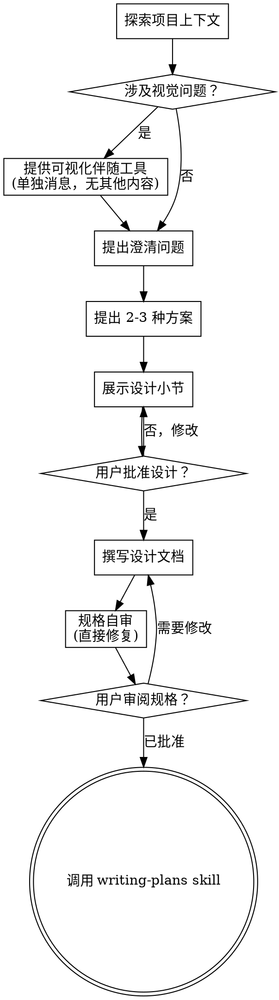

# 把想法梳理成设计

通过自然的协作对话，把模糊想法整理成完整设计和规格说明。

先理解当前项目上下文（context），再一次只问一个问题来逐步明确想法。等你理解要构建什么之后，提出设计方案并取得用户确认。

<HARD-GATE>
在展示设计并获得用户批准之前，不得调用任何实现类 skill，不得写代码、搭建项目脚手架，或执行任何实现动作。无论项目看起来多简单，这条规则都适用。
</HARD-GATE>

## 反模式：“这个太简单，不需要设计”

每个项目都要经过这个流程。待办清单、单函数工具、配置变更都一样。“简单”项目最容易因为未经检查的假设浪费时间。真正简单的项目可以只写几句话设计，但你必须先展示设计并获得批准。

## 检查清单

你必须为以下每一项创建任务，并按顺序完成：

1. **探索项目上下文**：检查文件、文档和近期提交。
2. **提供可视化伴随工具**（如果主题会涉及视觉问题）：这必须是一条独立消息，不得和澄清问题合并。详见下方“可视化伴随工具”小节。
3. **提出澄清问题**：一次只问一个，理解目的、约束和成功标准。
4. **提出 2-3 种方案**：说明取舍，并给出你的推荐。
5. **展示设计**：按复杂度分小节展示，每节展示后都请用户确认。
6. **写设计文档**：保存到 `docs/superpowers/specs/YYYY-MM-DD-<topic>-design.md` 并提交。
7. **规格自审**：快速检查占位符、矛盾、歧义和范围问题（见下文）。
8. **用户审阅已写好的规格**：请用户在继续前审阅规格文件。
9. **切换到实现计划**：调用 `writing-plans` skill 创建实现计划。

## 流程图

**终止状态是调用 `writing-plans`。** 不得调用 `frontend-design`、`mcp-builder` 或任何其他实现类 skill。brainstorming 之后唯一允许调用的 skill 是 `writing-plans`。

## 流程

**理解想法：**

- 先检查当前项目状态：文件、文档、近期提交。
- 在提出详细问题前，先判断范围。如果请求包含多个相互独立的子系统（例如“做一个包含聊天、文件存储、账单和分析的平台”），要立即指出范围过大。不要把问题花在细化一个本应先拆分的项目上。
- 如果项目太大，无法放进单个规格，帮助用户拆成子项目：哪些部分相互独立、它们如何关联、应该按什么顺序构建。然后按正常设计流程 brainstorm 第一个子项目。每个子项目都走自己的规格 -> 计划 -> 实现周期。
- 对范围合适的项目，一次只问一个问题来细化想法。
- 能用多选问题时优先用多选；开放问题也可以。
- 每条消息只问一个问题。如果一个主题需要继续探索，就拆成多轮问题。
- 重点理解：目的、约束、成功标准。

**探索方案：**

- 提出 2-3 种不同方案，并说明取舍。
- 用对话式表达展示选项，给出你的推荐和理由。
- 先展示推荐方案，并解释为什么推荐。

**展示设计：**

- 当你认为已经理解要构建的内容后，展示设计。
- 每个小节按复杂度调整长度：直接的问题写几句话；复杂问题最多约 200-300 词。
- 每展示一个小节后，都询问用户到目前为止是否正确。
- 覆盖：架构、组件、数据流、错误处理、测试。
- 如果某些内容不清楚，随时回到澄清问题。

**为隔离性和清晰度设计：**

- 把系统拆成更小的单元。每个单元都应该有清晰职责，通过明确接口通信，并且能独立理解和测试。
- 对每个单元，你都应该能回答：它做什么、如何使用、依赖什么。
- 别人能否不读内部实现就理解这个单元？能否修改内部实现而不破坏调用方？如果不能，边界还需要调整。
- 更小、边界清楚的单元也更适合 agent 工作：上下文范围更可控，编辑聚焦文件时更可靠。文件变得很大时，通常说明它承担了太多职责。

**在现有代码库中工作：**

- 提出改动前先探索当前结构，遵循已有模式。
- 如果现有代码问题会影响当前工作（例如某个文件过大、边界不清、职责纠缠），可以把有针对性的改进纳入设计。这是开发者在完成当前任务时应做的局部改善。
- 不要提出无关重构。只处理服务于当前目标的内容。

## 设计之后

**文档：**

- 将已确认的设计（spec）写入 `docs/superpowers/specs/YYYY-MM-DD-<topic>-design.md`。
  - 如果用户对规格位置有偏好，以用户偏好为准。
- 如果 `elements-of-style:writing-clearly-and-concisely` skill 可用，使用它改善文字表达。
- 将设计文档提交到 git。

**规格自审：**

写完规格文档后，用新的视角检查：

1. **占位符扫描：** 是否还有 “TBD”“TODO”、未完成小节或含糊需求？如有，修复。
2. **内部一致性：** 小节之间是否互相矛盾？架构是否匹配功能描述？
3. **范围检查：** 它是否足够聚焦，能进入单个实现计划？是否需要拆分？
4. **歧义检查：** 是否存在可被两种方式理解的需求？如有，选定一种并写清楚。

发现问题后直接在文档中修复。无需重新评审；修好后继续流程。

**用户审阅关卡：**

规格自审通过后，请用户在继续前审阅已写好的规格：

> "规格已写入并提交到 `<path>`。请先审阅一下，如果要调整内容，请告诉我；确认后我们再开始写实现计划。"

等待用户回复。如果用户要求修改，就修改并重新执行规格自审。只有用户批准后才能继续。

**实现：**

- 调用 `writing-plans` skill 创建详细实现计划。
- 不得调用任何其他 skill。下一步只能是 `writing-plans`。

## 关键原则

- **一次只问一个问题**：不要一次抛出多个问题。
- **优先多选**：在合适时，多选比开放问题更容易回答。
- **严格遵守 YAGNI**：从所有设计中移除不必要功能。
- **探索替代方案**：确定方案前，总是先提出 2-3 种方案。
- **增量确认**：展示设计，获得批准后再继续。
- **保持灵活**：当内容不合理或不清楚时，回到澄清。

## 可视化伴随工具

可视化伴随工具是一个基于浏览器的工具，用于在 brainstorming 期间展示 mockup、图表和视觉选项。它是一个工具，不是模式。用户接受后，只表示可以在适合视觉表达的问题上使用；并不意味着每个问题都要通过浏览器完成。

**提供可视化伴随工具：** 如果你预计后续问题会涉及视觉内容（mockup、布局、图表），先征求一次同意：

> "接下来有些内容可能用浏览器展示会更清楚。我可以边聊边做 mockup、图表、对比图或其他视觉材料。这个功能还比较新，也可能比较消耗 token。要试一下吗？（需要打开一个本地 URL）"

**这条邀请必须单独成一条消息。** 不要把它和澄清问题、上下文总结或其他内容合并。消息内容只能包含上面的邀请文本。等待用户回复后再继续。如果用户拒绝，就按纯文本 brainstorming 继续。

**逐题判断：** 即使用户接受了可视化伴随工具，也要对每个问题单独判断该用浏览器还是终端。判断标准是：**用户看见它是否会比阅读它更容易理解？**

- **使用浏览器**：用于视觉内容，例如 mockup、线框图、布局对比、架构图、并排视觉设计。
- **使用终端**：用于文本内容，例如需求问题、概念选择、取舍列表、A/B/C/D 文本选项、范围决策。

关于 UI 的问题不一定就是视觉问题。“这里的个性是什么意思？”是概念问题，应使用终端。“哪种向导布局更合适？”是视觉问题，应使用浏览器。

如果用户同意使用可视化伴随工具，在继续前阅读详细指南：

`skills/design/brainstorming/visual-companion.md`
